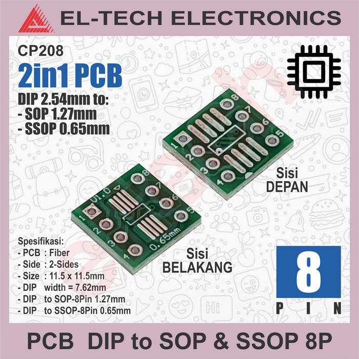
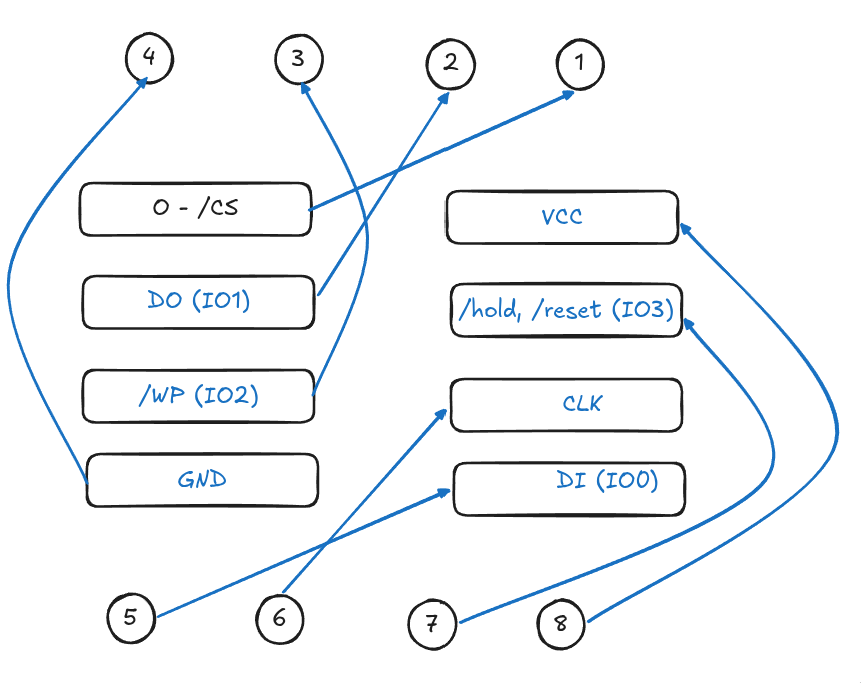
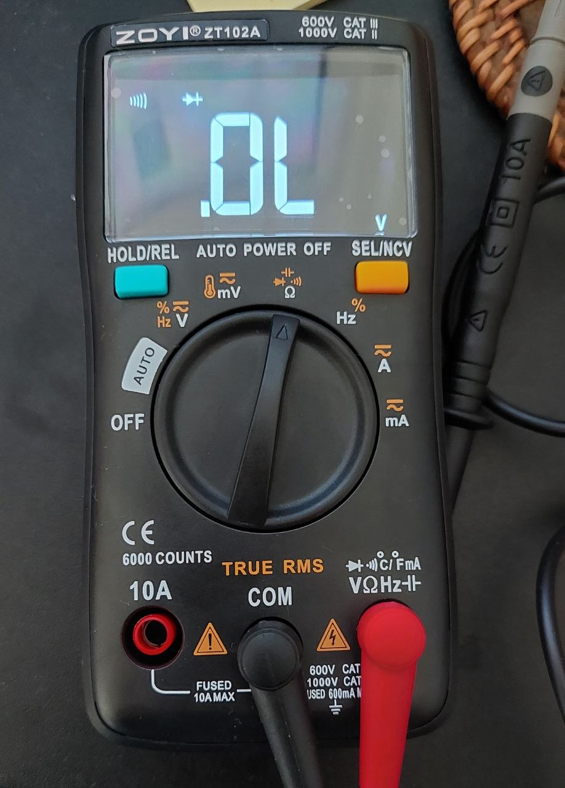

# winbond

## owned

- W25Q64JVSSIQ
- W25Q128JVSQ

## connection using generic PCB

generic PCB used

connection meaning (checked using multimeter continuity test)

## multimeter continuity test

click "SEL/NCV" until it shows `)))))`

